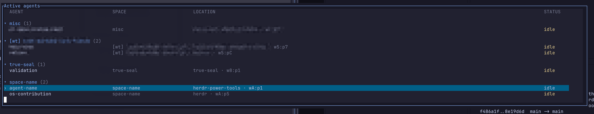
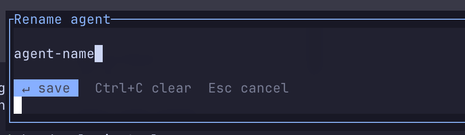
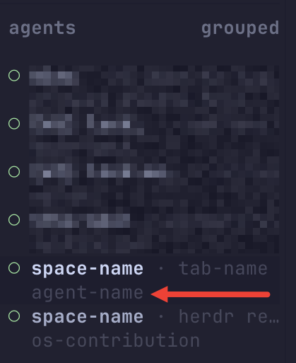

# Herdr Agent Nav

Keyboard-first agent navigation and naming for [Herdr](https://herdr.dev).

## What works today

| Tool | What it does | Suggested binding |
| --- | --- | --- |
| Active-agent picker | Search, group, and jump to every non-finished agent. | `prefix+shift+g` |
| Rename current agent | Give the focused agent a native Herdr alias. | `prefix+shift+a` |

Requires Herdr **0.9.0+** and Node.js **18+**. The plugin has no npm dependencies and currently supports macOS and Linux.

## Demo

The active-agent picker groups agents by Space, supports live filtering, and opens the selected agent's exact pane.



`<Leader> + Shift+A` opens a compact rename prompt for the focused agent.



The resulting alias is rendered by Herdr's native Agents sidebar in place of the generic agent kind.



## Install

From GitHub after publishing:

```sh
herdr plugin install julianbonomini/herdr-agent-nav
```

For local development:

```sh
herdr plugin link "$(pwd)"
```

## Configure shortcuts

Herdr plugins do not choose or modify your keybindings. Add one or both action blocks below to `~/.config/herdr/config.toml`, replacing the `key` values with shortcuts that fit your setup. `prefix` means the leader key configured under `[keys]`.

```toml
# Open the active-agent picker.
[[keys.command]]
key = "prefix+shift+g"
type = "shell"
command = "herdr plugin action invoke herdr.agent-nav.open-active-picker"
description = "jump to active agent"

# Rename the focused agent in Herdr's native Agents sidebar.
[[keys.command]]
key = "prefix+shift+a"
type = "shell"
command = "herdr plugin action invoke herdr.agent-nav.open-rename"
description = "rename focused agent"
```

The complete copy-ready example is in [`config.example.toml`](config.example.toml). Reload after saving with your configured reload shortcut, or run:

```sh
herdr server reload-config
```

The `herdr.agent-nav` portion of each command is the plugin's internal ID.

## Navigation behavior

Herdr treats an agent as `done` when it is idle and has not yet been seen. The picker includes `working`, `blocked`, `idle`, and `unknown` agents, and excludes only `done` agents.

Press `↑`/`↓` (or `j`/`k`) to select an agent, type to filter, and press `Enter` to navigate to its exact pane. The picker groups agents by Space and shows Space, location, and status.

`Rename current agent` calls Herdr's native `agent rename` command. The alias is rendered in Herdr's Agents sidebar in place of the generic agent kind. Herdr agent aliases accept lowercase letters, digits, hyphens, and underscores.

## Deliberately not implemented

Herdr's plugin v1 API can declare actions and terminal popups, but it cannot intercept raw key events or render/resize native UI. That means these ideas need an upstream Herdr feature rather than a plugin workaround:

- `Leader + L L L` key-sequence repetition
- temporarily widening the native sidebar or native hover tooltips
- changing results in Herdr's global search

## Development

```sh
npm test
herdr plugin link "$(pwd)"
herdr plugin action invoke herdr.agent-nav.toggle-active-view
```

Inspect plugin command logs with:

```sh
herdr plugin log list --plugin herdr.agent-nav --limit 20
```

## Publishing

Push a tagged release, add the `herdr-plugin` GitHub topic, and the Herdr marketplace can discover this repository automatically. Users then install it with `herdr plugin install julianbonomini/herdr-agent-nav`.

## License

[MIT](LICENSE)
